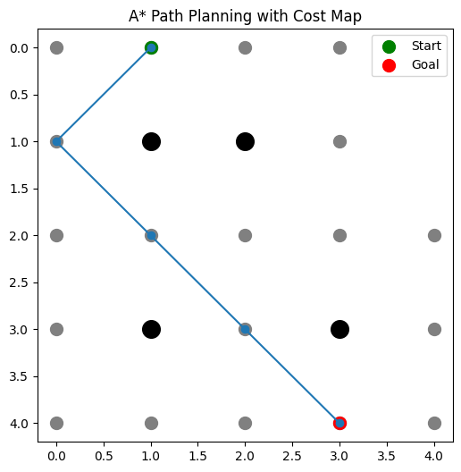

# A* Path Planning (Robotics)

## Overview
This project demonstrates the A* path planning algorithm used in robotics for finding the shortest path in a grid-based environment with obstacles.

It highlights how heuristic-driven search improves efficiency compared to uninformed algorithms like BFS and Dijkstra.

## Features
- Grid-based navigation
- Obstacle avoidance
- Shortest path using A*
- Visualization using matplotlib

## Example Output


## How to Run
```bash
pip install matplotlib
python main.py