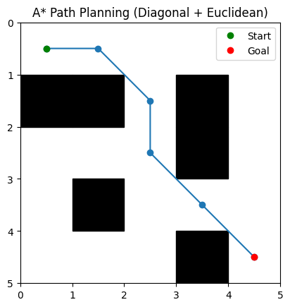

# 🤖 Robotics Path Planning using A*

This project implements the A* (A-Star) algorithm for path planning on a 2D grid.

## 🚀 Features
- A* pathfinding algorithm
- Manhattan distance heuristic
- Obstacle avoidance
- Grid-based visualization using matplotlib
- Multiple map selection

## 🧠 Algorithm
A* uses:
f(n) = g(n) + h(n)

- g(n): cost from start to node
- h(n): heuristic (Manhattan distance)
- f(n): total estimated cost

## 📸 Output


## ▶️ How to Run
```bash
python main.py